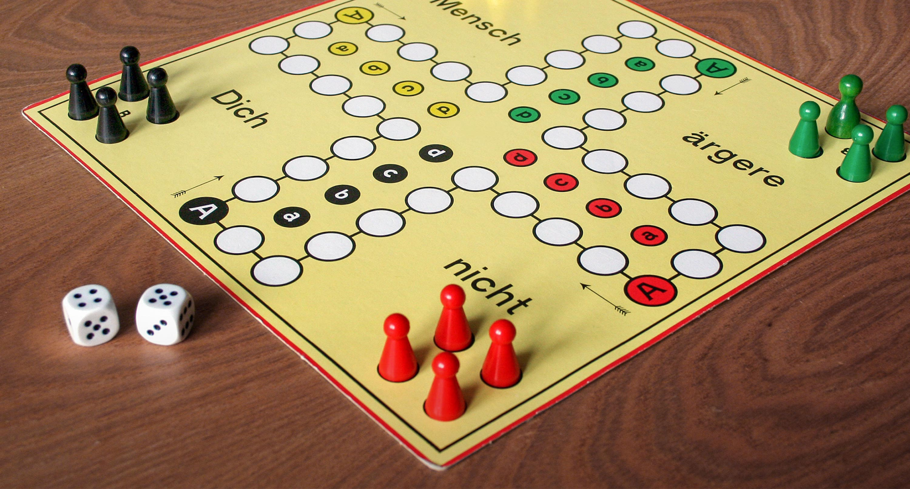

# bwinf40 | A4: Würfelglück

Barbara findet auf dem Dachboden eine Kiste mit vielen verschiedenen Spielwürfeln. Ein "normaler" ist dabei, der sechs Seiten hat mit den Zahlen 1 bis 6.
Ein anderer hat auch sechs Seiten, aber dreimal die 1 und dreimal die 6.
Und dann gibt es noch welche mit ganz anderen Formen, zum Beispiel mit 4, 10, 12 oder gar 20 Seiten.

Zum großen Einsatz kommt die Kiste beim nächsten gemeinsamen Spieleabend mit ihren Freunden.
Jeder darf sich einen Würfel aussuchen und es wird "Mensch ärgere Dich nicht" gespielt.
Es kommt schnell eine Diskussion auf, welcher Würfel denn die besten Chancen einräumt.
Anna ist begeistert von dem 20-seitigen Würfel, weil sie in einem Zug bis zu 20 Schritte machen kann.
Clemens hingegen findet es viel wichtiger, dass er oft eine 6 würfelt.
Denn diese benötigt man weiterhin, um eine Figur auf das Startfeld zu stellen.

## Aufgabe 4

Hilf den Freunden und schreibe ein Programm, das eine Liste von Würfeln einliest und bestimmt, wie gut diese Würfel geeignet sind, um das Spiel zu gewinnen.
Vergleiche dazu jeden Würfel mit jedem anderen.
Um festzustellen, welcher von zwei gegebenen Würfeln besser ist, simuliere ausreichend viele Spiele zweier Personen, wobei beide je einen anderen Würfel verwenden.
Natürlich sollen in der Hälfte der Simulationen die erste Person anfangen und in der anderen die andere.
Eine genaue Beschreibung der für die Simulation gültigen Spielregeln findest du in der [Spielregeln PDF](/spielregeln.pdf), das Spielfeld sieht so aus:

Wende dein Programm mindestens auf alle Beispiele an, die du im Ordner [/beispieldaten](/beispieldaten) findest, und dokumentiere die Ergebnisse.
  
